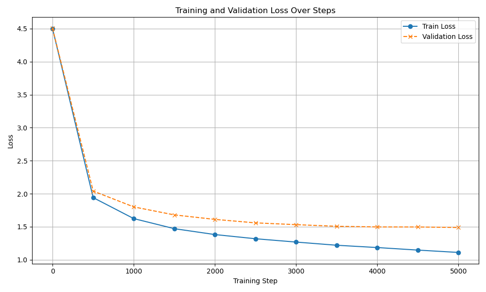

# Transformer Decoder Implementation (Pytorch)

### <i>"What you cannot build you don't understand" - Richard Feynman</i> 

Implemented a transformer decoder architecture (with some modifications to the decoder presented in the original <i>Attention is all you need</i> paper) using Pytorch.

Trained a 10.8m parameter model (41 MB) on 1.1 million tokens of Shakespeare with 1 x NVIDIA GeForce GTX 1650 GPU using ~1GB/4GB VRAM.

Employed gradient checkpointing to reduce GPU memory consumption during training and optimized Multi-Head Attention by performing Query, Key, and Value projections for all heads simultaneously via single batched transformations, maximizing GPU throughput for training speed.

Training time was ~2.5 hours over 5000 epochs with Cross Entropy loss function and AdamW optimizer:



Key Files: 
- `llm.py` - main model file
- `inference.py` - model inference with user prompt and model completion 
- `model.pth` - saved model weights
- `more.txt` - sample model output

Hyperparameter values and character level tokenizer were taken from Andrej Karpathy's implementation: https://github.com/karpathy/ng-video-lecture/blob/master/gpt.py.

To use: 
```
>>> git clone https://github.com/rohank36/llm.git
# have env with pytorch activated
# change hyperparams in llm.py to your liking
>>> python llm.py 
# write your prompt in inference.py
>>> python inference.py
```

Sample output:
```
COMINIUS:
Let's death shall steal the house of Signior,
All well I say.

Second Citizen:
In this was he shall be absent.

CORIOLANUS:
I have no knot:
Out of the rock!

VOLUMNIA:
I come to the Tum--

Third Citizens:
And if I think it: for else, return me by the house of you
Will I died, with the Lady Via as as it.

First Senator:
Now, he is that a man to the world
That pass'd money's husband: but the racely
The inutomary srettle belome and statues; mills it be boy.

Second Murderer:
I am committe
```

Sample output from prompt:
```
PROMPT:
Friends, Romans, countrymen, lend me your ears;
I come to bury Caesar, not to praise him.
The evil that men do lives after them;
The good is oft interred with their bones;

COMPLETION: 
Friends, Romans, countrymen, lend me your ears;
I come to bury Caesar, not to praise him.
The evil that men do lives after them;
The good is oft interred with their bones;
For now can deceit unto the cormonutation,
I will be from alter.

CORIOLANUS:
Peace, my good cousin,
As a tyranny, come, from these fearful sheep-son
Tied,--I cannot more than than are the way
Which can from my proceeding; hideous that master
Than when I will war.

SICINIUS:
Such are our affuitation:
Being commoditions to put me on.

BRUTUS:
If you will not advised them.

BRUTUS:
The other had more of my child,
And he hath cut my father, draw from me to this?

SICINIUS:
Midwise him in the oracle: as you,
Behold it now couple my should run on the earth, which is it
It passes you would frame to thee no: thoughts,
Though apparticulate you,
You would perfects, that you can shall stand to pide!

SICINIUS:
Make you of you; I am convented him good!--

Blood Citizen:
Let's hear him shall reframed found your dreaminess
Plub to him.

BRUTUS:
Be that the fright.

ROMEO:
Wilt, be late?

SICINIUS:
What 'brow's, I do not fight them?

COMINIUS:
Be committed in the Duke of Sicilius!

FLORIZEL:
This I
```
